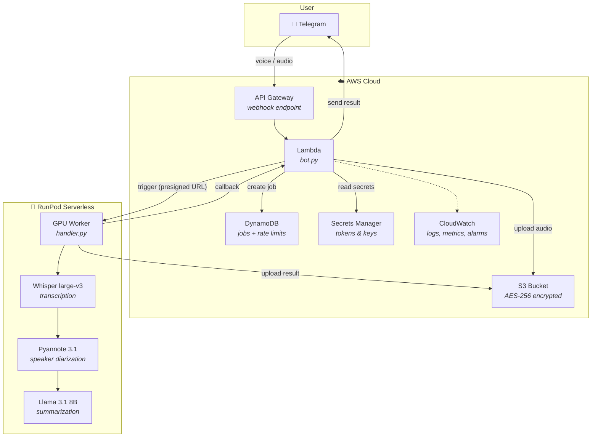
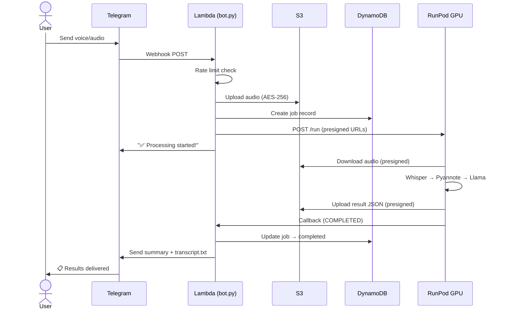

<


<p align="center">
  
  
  
  
</p>

---

## What It Does

Send a voice message or audio file to a Telegram bot → get back:

| Output | Description |
|--------|-------------|
| 📋 **Structured Summary** | Key points split into Commerce / Operations / Technical |
| 📌 **Action Items** | Tasks with assigned owners, deadlines, and priorities |
| 📄 **Full Transcript** | Speaker-labeled, timestamped transcript as a `.txt` file |

**Cost per hour of audio: ~$0.15** (GPU compute only, zero cost when idle).

---

## Architecture



---

## Data Flow



---

## Project Structure

```
callsum/
├── telegram_bot/
│   ├── bot.py              # Lambda handler — Telegram webhook + RunPod callback
│   ├── bot_local.py         # Local dev — polling mode (no AWS required for testing)
│   └── requirements.txt
│
├── runpod_service/
│   ├── handler.py           # GPU worker — Whisper + Pyannote + Llama 3.1
│   ├── Dockerfile           # CUDA 12.1 + model preloading
│   └── requirements.txt
│
├── infrastructure/
│   └── terraform/           # Complete IaC — Lambda, API GW, S3, DynamoDB, etc.
│       ├── main.tf
│       ├── lambda.tf
│       ├── api_gateway.tf
│       ├── s3.tf
│       ├── dynamodb.tf
│       ├── iam.tf
│       ├── secrets.tf
│       ├── monitoring.tf
│       └── variables.tf
│
├── deployment/
│   ├── deploy_aws.sh        # One-click AWS deployment
│   ├── deploy_runpod.sh     # One-click RunPod deployment
│   ├── build_lambda_package.sh
│   └── validate_deployment.sh
│
├── docs/                    # 📖 All documentation lives here
│   ├── README.md            # Documentation index
│   ├── ARCHITECTURE.md      # System design & data flow
│   ├── CONFIGURATION.md     # All environment variables
│   ├── API.md               # Webhook & callback contracts
│   ├── HANDOFF_CHECKLIST.md # Step-by-step deployment checklist
│   └── PROJECT_STATUS.md    # Current status & known limitations
│
└── test_deployment_contracts.py  # Contract smoke tests
```

---

## Quick Start

### Prerequisites

| Tool | Version | Purpose |
|------|---------|---------|
| AWS CLI | 2.x | Cloud management |
| Terraform | ≥ 1.0 | Infrastructure provisioning |
| Docker | Latest | RunPod image build |
| Python | 3.10+ | Local development & tests |

### 1. Clone & configure

```bash
git clone https://github.com/sapirl7/Callsum.git
cd Callsum

# Terraform variables
cd infrastructure/terraform
cp terraform.tfvars.example terraform.tfvars
# Edit terraform.tfvars with your tokens and keys
```

### 2. Deploy infrastructure

```bash
terraform init
terraform plan
terraform apply
```

### 3. Deploy ML service

```bash
cd ../../deployment
./deploy_runpod.sh
```

### 4. Set Telegram webhook

```bash
WEBHOOK_URL=$(cd ../infrastructure/terraform && terraform output -raw api_gateway_url)
BOT_TOKEN="your-bot-token"

curl -s -X POST "https://api.telegram.org/bot${BOT_TOKEN}/setWebhook" \
  -H "Content-Type: application/json" \
  -d "{\"url\": \"${WEBHOOK_URL}\"}"
```

### 5. Test it

Send a voice message to your bot → get a summary back!

---

## ML Pipeline

| Stage | Model | What It Does | Resource |
|-------|-------|-------------|----------|
| 1. Transcription | **Whisper large-v3** | Speech → text with word timestamps | ~3 GB VRAM |
| 2. Diarization | **Pyannote 3.1** | Identify who said what | ~1 GB VRAM |
| 3. Summarization | **Llama 3.1 8B Instruct** | Structured JSON summary via vLLM | ~10 GB VRAM |

**Minimum GPU**: RTX 3090 (24 GB) or A4000 (16 GB)

**Graceful degradation**: if the LLM fails, the bot still returns the full transcript with speaker labels.

---

## Cost Breakdown

### Monthly estimate (100 calls/month)

| Service | Cost |
|---------|------|
| AWS Lambda | $0.20 |
| S3 (encrypted, versioned) | $0.50 |
| DynamoDB (on-demand) | $0.25 |
| API Gateway | $0.35 |
| CloudWatch | $0.30 |
| Secrets Manager | $1.20 |
| **RunPod GPU** (30 hrs × $0.44) | **$13.20** |
| **Total** | **~$16/month** |

> **Zero idle cost** — serverless architecture means $0 when nobody is using it.

---

## Supported Formats

| Format | Source |
|--------|--------|
| `.ogg` | Telegram voice messages |
| `.mp3` | Standard audio files |
| `.wav` | Uncompressed audio |
| `.m4a` | Apple / mobile recordings |
| `.webm` | Browser recordings |

**Limits**: max 2 hours duration, max 100 MB file size, 10 req/hr and 50 req/day per user.

---

## Documentation

| Document | Description |
|----------|-------------|
| [docs/ARCHITECTURE.md](docs/ARCHITECTURE.md) | System design, data flow diagrams, security model |
| [docs/CONFIGURATION.md](docs/CONFIGURATION.md) | All environment variables with defaults |
| [docs/API.md](docs/API.md) | Webhook and callback API contracts |
| [docs/HANDOFF_CHECKLIST.md](docs/HANDOFF_CHECKLIST.md) | Step-by-step deployment & verification checklist |
| [docs/PROJECT_STATUS.md](docs/PROJECT_STATUS.md) | What works, what needs staging verification |
| [docs/DEPLOYMENT_GUIDE.md](docs/DEPLOYMENT_GUIDE.md) | Detailed deployment walkthrough |

---

## License

MIT — see [LICENSE](LICENSE) for details.

## Acknowledgments

- [OpenAI Whisper](https://github.com/openai/whisper) — speech recognition
- [Pyannote Audio](https://github.com/pyannote/pyannote-audio) — speaker diarization
- [Meta Llama 3.1](https://ai.meta.com/llama/) — text summarization
- [RunPod](https://runpod.io) — serverless GPU infrastructure
- [vLLM](https://github.com/vllm-project/vllm) — high-throughput LLM serving
]]>
