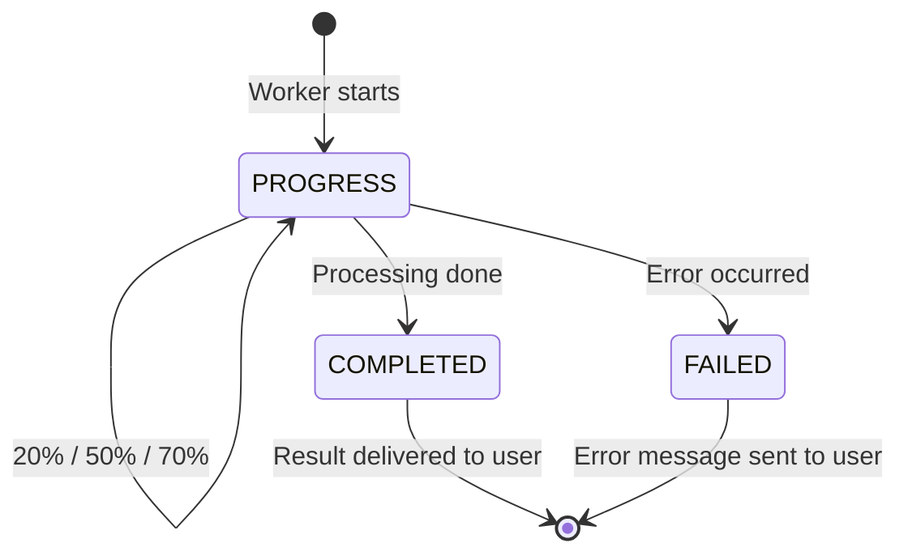

<![CDATA[# API Reference

Callsum exposes a minimal external API surface through AWS API Gateway.

---

## Endpoints

| Method | Path | Source | Purpose |
|--------|------|--------|---------|
| `POST` | `/webhook` | Telegram Bot API | Incoming messages |
| `POST` | `/webhook` | RunPod Worker | Processing results callback |
| `GET` | `/health` | Any | Health check |

Both Telegram and RunPod use the same Lambda function endpoint. The handler distinguishes between them by inspecting the request body.

---

## Telegram Webhook

### Request

Telegram sends standard [Update](https://core.telegram.org/bots/api#update) objects.

**Authentication:** Header `X-Telegram-Bot-Api-Secret-Token` must match `TELEGRAM_SECRET_TOKEN`.

### Detection Logic

```python
is_telegram = 'update_id' in body or 'message' in body
```

### Supported Message Types

| Type | Trigger |
|------|---------|
| `/start` | Welcome message |
| `/help` | Usage instructions |
| `/status <job_id>` | Job status check |
| Voice message | Start processing |
| Audio file | Start processing |

---

## RunPod Callback

### Request

```json
{
  "job_id": "uuid",
  "chat_id": "12345678",
  "status": "COMPLETED | PROGRESS | FAILED",
  "result": { ... },     // only when COMPLETED
  "progress": 50,        // only when PROGRESS
  "message": "...",      // only when PROGRESS
  "error": "..."         // only when FAILED
}
```

**Authentication:** Header `X-Runpod-Callback-Token` must match `RUNPOD_CALLBACK_TOKEN`.

### Detection Logic

```python
is_runpod_callback = 'job_id' in body and 'status' in body
```

### Status Flow



### Progress Milestones

| Progress % | Message | Stage |
|-----------|---------|-------|
| 10 | 📥 Скачивание аудио... | Download |
| 20 | 🎙 Транскрибирую речь... | Whisper |
| 50 | 👥 Определяю спикеров... | Pyannote |
| 70 | 🤖 Генерирую саммари... | Llama |
| 100 | ✅ Готово! | Complete |

---

## RunPod Job Input

When Lambda triggers RunPod, it sends:

```json
{
  "input": {
    "job_id": "uuid",
    "s3_bucket": "callsum-prod",
    "s3_key": "users/{uid}/audio/new/{job_id}.ogg",
    "audio_download_url": "https://...presigned...",
    "result_upload_url": "https://...presigned...",
    "result_key": "users/{uid}/results/{job_id}.json",
    "user_id": "12345678",
    "chat_id": "12345678",
    "callback_url": "https://api-gateway-url/webhook"
  }
}
```

---

## Health Check

```bash
GET /health
```

Response:
```json
{
  "status": "healthy",
  "service": "callsum-api",
  "timestamp": "2026-03-22T10:30:00Z",
  "version": "1.0.0"
}
```

---

## Result JSON Schema

The final result stored in S3 and sent via callback:

```json
{
  "job_id": "uuid",
  "status": "completed",
  "full_transcript": "[SPEAKER_00, 00:00]: Hello...\n[SPEAKER_01, 00:15]: ...",
  "discussed": {
    "commerce": "Summary text or null",
    "operations": "Summary text or null",
    "technical": "Summary text or null"
  },
  "tasks": {
    "commerce": [
      {
        "task": "Description",
        "responsible": "Name or 'не указан'",
        "deadline": "Date or 'не указан'",
        "priority": "high | medium | low"
      }
    ],
    "operations": [],
    "technical": []
  },
  "metadata": {
    "duration": 3600.5,
    "language": "ru",
    "num_speakers": 3,
    "num_words": 12500,
    "llm_error": null
  },
  "warning": null
}
```
]]>
