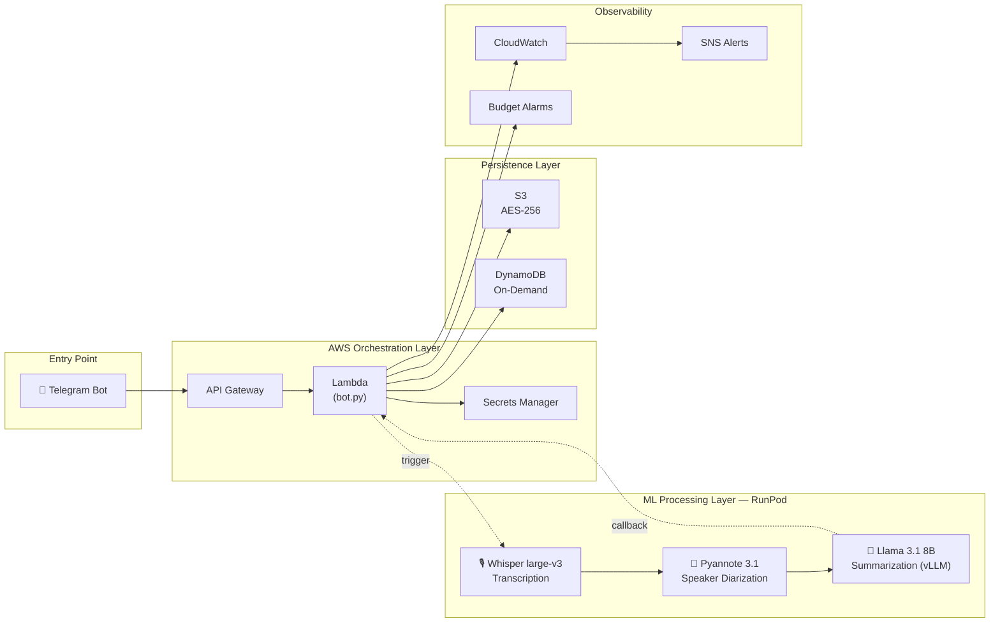
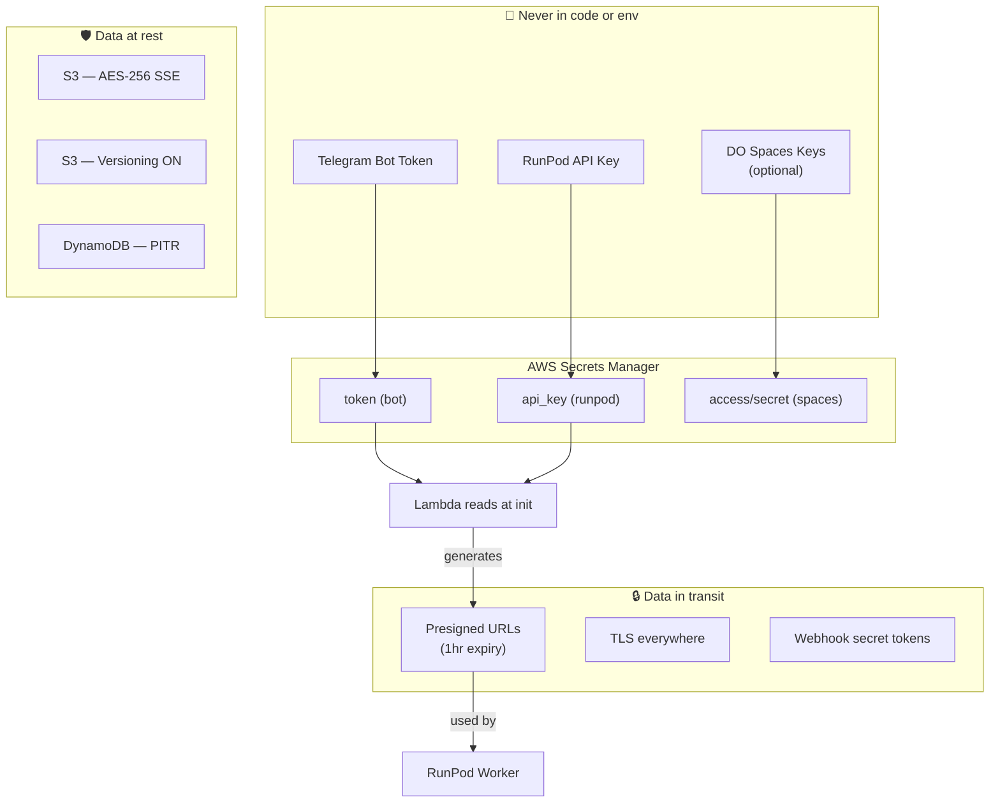
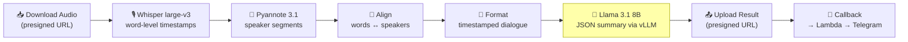

# Architecture

## System Overview

Callsum is a serverless audio analysis pipeline that processes voice recordings through three ML stages and delivers structured meeting notes via Telegram.



---

## Component Responsibilities

| Component | File | Runtime | Responsibility |
|-----------|------|---------|---------------|
| **Telegram Bot** | `telegram_bot/bot.py` | AWS Lambda | Accept audio, validate, upload to S3, create job, trigger RunPod, deliver results |
| **ML Worker** | `runpod_service/handler.py` | RunPod Serverless GPU | Download audio, transcribe, diarize, summarize, upload result, send callback |
| **Infrastructure** | `infrastructure/terraform/*.tf` | Terraform | Provision all AWS resources as code |
| **Deployment Scripts** | `deployment/*.sh` | Shell | Automate build & deploy steps |

---

## Security Model



**Key decisions:**
- RunPod **never** gets AWS credentials — only time-limited presigned URLs
- Telegram webhook is validated via `X-Telegram-Bot-Api-Secret-Token`
- RunPod callback is validated via `X-Runpod-Callback-Token`
- All S3 data is encrypted at rest (AES-256 SSE)
- DynamoDB records auto-expire via TTL (30 days)
- S3 audio files auto-delete via lifecycle rules (30 days)

---

## ML Pipeline Detail



**Graceful degradation**: If the LLM (step 6) fails, the pipeline still returns the full speaker-labeled transcript. The `llm_error` field is populated in the result metadata so the bot can inform the user.

---

## Processing Time Estimates

| Audio Length | Transcription | Diarization | Summary | Total |
|-------------|---------------|-------------|---------|-------|
| 5 min | ~30s | ~20s | ~10s | **~1 min** |
| 30 min | ~3 min | ~2 min | ~30s | **~6 min** |
| 1 hour | ~6 min | ~4 min | ~1 min | **~11 min** |
| 2 hours | ~12 min | ~8 min | ~2 min | **~22 min** |

*Estimates on RTX 3090. Actual times depend on GPU availability and cold start.*

---

## Storage Layout

```
s3://callsum-prod/
├── users/{user_id}/
│   ├── audio/new/{job_id}.ogg    # Uploaded audio (30-day retention)
│   └── results/{job_id}.json     # Processing result (90-day retention)
```

DynamoDB tables:
- `callsum-jobs` — job tracking (job_id, status, progress, timestamps)
- `callsum-jobs-rate-limits` — per-user rate counters with TTL
