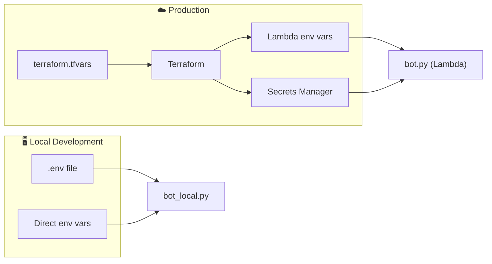

# Configuration Reference

All configurable parameters, organized by component.

---

## Telegram Bot (Lambda)

| Variable | Required | Default | Description |
|----------|----------|---------|-------------|
| `TELEGRAM_BOT_TOKEN_SECRET_ARN` | ✅* | — | ARN of Secrets Manager secret containing `{"token": "..."}` |
| `TELEGRAM_BOT_TOKEN` | Fallback | — | Direct token (for local dev only; use Secrets Manager in prod) |
| `TELEGRAM_SECRET_TOKEN` | Recommended | `""` | Webhook validation token (set same value in Telegram `setWebhook`) |

\* Either `_SECRET_ARN` or the direct env var must be set.

---

## RunPod

| Variable | Required | Default | Description |
|----------|----------|---------|-------------|
| `RUNPOD_ENDPOINT_URL` | ✅ | — | RunPod serverless endpoint URL (e.g. `https://api.runpod.ai/v2/xxx`) |
| `RUNPOD_API_KEY_SECRET_ARN` | ✅* | — | ARN of Secrets Manager secret containing `{"api_key": "..."}` |
| `RUNPOD_API_KEY` | Fallback | — | Direct key (for local dev only) |
| `RUNPOD_CALLBACK_TOKEN` | Recommended | `""` | Shared secret for authenticating RunPod → Lambda callbacks |
| `CALLBACK_URL` | ✅ | — | URL that RunPod calls back with results (your API Gateway URL) |
| `HF_TOKEN` | ✅ | — | Hugging Face token for downloading Pyannote & Llama models |

---

## Storage & Database

| Variable | Required | Default | Description |
|----------|----------|---------|-------------|
| `S3_BUCKET_NAME` | ✅ | `callsum-prod` | S3 bucket for audio files and results |
| `S3_ENDPOINT_URL` | Optional | — | Custom S3 endpoint (e.g. DigitalOcean Spaces: `https://fra1.digitaloceanspaces.com`) |
| `DO_SPACES_SECRET_ARN` | Optional | — | ARN for DO Spaces credentials in Secrets Manager |
| `DYNAMODB_TABLE_NAME` | ✅ | `callsum-jobs` | DynamoDB table for job records |
| `RATE_LIMITS_TABLE_NAME` | ✅ | `callsum-jobs-rate-limits` | DynamoDB table for rate limiting |
| `AWS_REGION` | ✅ | `us-east-1` | AWS region for all services |

---

## Runtime Limits

| Variable | Default | Description |
|----------|---------|-------------|
| `MAX_AUDIO_DURATION_SECONDS` | `7200` | Maximum audio length (2 hours) |
| `MIN_AUDIO_DURATION_SECONDS` | `1` | Minimum audio length |
| `MAX_FILE_SIZE_MB` | `100` | Maximum upload size in megabytes |
| `FREE_TIER_REQUESTS_PER_HOUR` | `10` | Rate limit: requests per hour per user |
| `FREE_TIER_REQUESTS_PER_DAY` | `50` | Rate limit: requests per day per user |

---

## Retry & Networking

| Variable | Default | Description |
|----------|---------|-------------|
| `MAX_RETRIES` | `3` | Number of retry attempts for RunPod calls |
| `RETRY_BACKOFF_MULTIPLIER` | `2` | Exponential backoff multiplier |
| `RETRY_MIN_WAIT_SECONDS` | `2` | Minimum wait between retries |
| `RETRY_MAX_WAIT_SECONDS` | `10` | Maximum wait between retries |
| `TELEGRAM_MAX_MESSAGE_LENGTH` | `4000` | Max chars per Telegram message (split if exceeded) |

---

## Configuration Sources

**Rule of thumb:**
- Secrets (tokens, keys) → **Secrets Manager** (never in env vars in production)
- Configuration (limits, URLs) → **Lambda environment variables** (set via Terraform)
- Local dev → `.env` file or direct env vars
